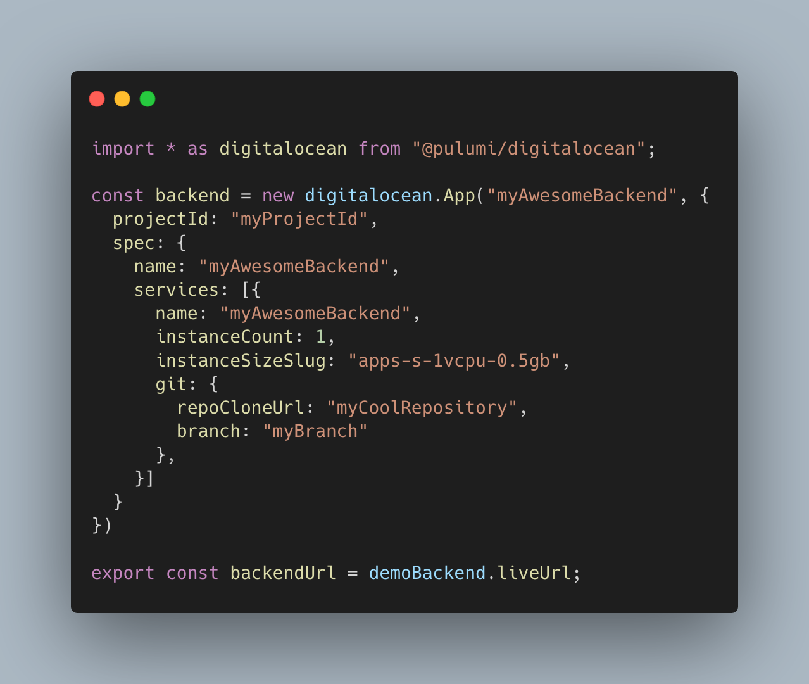
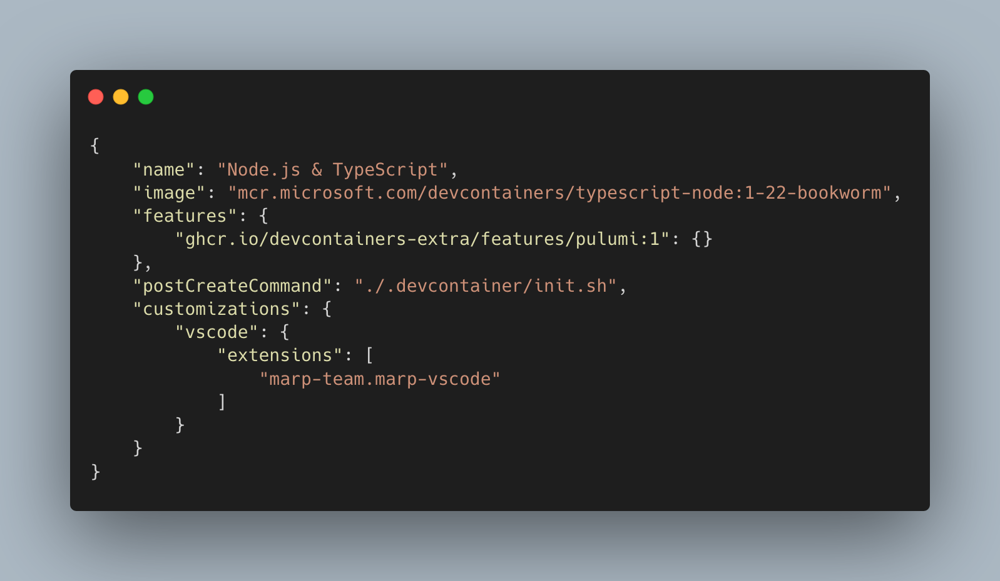

# Infrastructure as Code and Dev Containers 
#### A completely overkill setup for a simple Todo app

---

# The Pain Points of a Traditional Setup

* "It works on my machine!"
* Manual installation of SDKs, tools, dependencies
* Version conflicts and dependency hell
* Hours (or days) spent getting a new team member productive
* Difficulty creating consistent environments for testing
* Manual and error-prone test data setup
* Context switching overhead between projects

---

# The Goal

We want a simple workflow consisting of five steps:

1) Clone the repository
1) Fill in the necessary authentication tokens
1) Open the project in VSCode and "Reopen in Container"
1) Wait a few minutes for the infrastructure to come up
1) Run the app and start developing

---

# The Tools: Infrastructure as Code

* Manage and provision infrastructure through code
* Treat our environment setup like application code
* Key Principles:
  * **Repeatability:** Get the same environment every time
  * **Consistency:** Everyone uses the exact same setup
  * **Version Control:** Track changes, rollback, collaborate
  * **Automation:** Eliminate manual steps

---

There are many different IaC tools out there, e.g. *Terraform*, *OpenTofu*, *Bicep* and *Pulumi* but they all offer similar features:

* **Focus on the desired state**
* **Declarative**
* **Idempotency**

---

# The Tools: Dev Containers

* Standardized, reproducible development environments running inside a container
* Defined by code (`devcontainer.json`, `Dockerfile`).
* VS Code (or other compatible IDEs) detects configuration files and builds/pulls a container image.
* Starts a container with all necessary tools, dependencies, and configurations
* Mounts your project code into the container

---

---

# The Path

The `init.sh` script in the `postCreateCommand` section provides an easy way to setup all the things we need:

1) Provision the infrastructure and backend for our app
1) Store the URL of the backend as `EXPO_PUBLIC_API_URL` in an `.env` file readable by the frontend
1) Generate test data and store it in the database
1) Run `npm install` for the project and start `expo`

---

# The Cleanup

When we are done developing a new feature, the cleanup process of the infrastructure needs to be simple and automated:

* Create a Pull Request
* Merge the Pull Request into `main`
* A Github Action destroys all the infrastructure associated with the Pull Request
* Enjoy your well-earned treat

---

# Demo & Questions

---

# The Sky is the Limit

- Reduce the amount of manual steps as far as possible, ideally down to zero manual steps
- Speed up the infrastructure provisioning by reusing Database Clusters and other shared resources
- Add tools like `pre-commit`, `prettier`, `commitlint` and others to standardize the codebase
- Add security checks throughout the development process
- Provide all of this functionality via a self-service portal, i.e. an Internal Developer Platform

---

# Summary & Benefits

* **Faster** environment setup for development, testing and production
* **Consistent** environment and infrastructure
* **Cost optimized** resource management
* **Accelerated onboarding** for new hires/people new to the project
* **Focus on code** and not on configuration
* **Standardized development** within the project
* **Project Isolation** offer playgrounds where you can go nuts

---

# Resources

### Links

[Github Repository](https://github.com)
[https://www.pulumi.com/](https://www.pulumi.com/)
[https://containers.dev/](https://containers.dev/)

### Christoph Fritz

<i class="fa-brands fa-linkedin"></i> LinkedIn: [christoph-fritz](https://linkedin.com/in/christoph-fritz/)
<i class="fa-brands fa-github"></i> GitHub: [chrstphfrtz](https://github.com/chrstphfrtz)
<i class="fa-solid fa-earth-americas"></i> Website: [https://looparmor.dev](https://looparmor.com)

